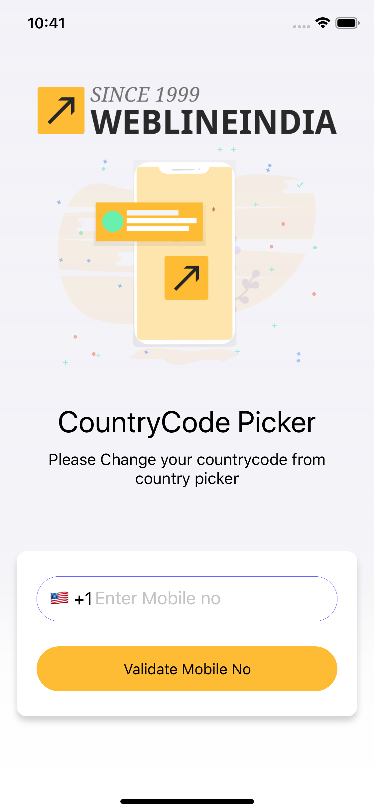

# iOS Country Code Picker

This is a iOS based CountryCode Picker which allows user to select country and enter mobile number.

## Table of contents
- [iOS Support](#iOS-support)
- [Demo](#demo)
- [Features](#features)
- [Getting started](#getting-started)
- [Usage](#usage)
- [Methods](#methods)
- [Want to Contribute?](#want-to-contribute)
- [Need Help / Support?](#need-help)
- [Collection of Components](#collection-of-Components)
- [Changelog](#changelog)
- [License](#license)
- [Keywords](#Keywords)

## iOS Support

Minimum iOS Target 13.0

## Demo

------

## Features
* Select country with flag & country code

## Getting started
Download this project and import required files in your project

## Usage
Setup below configuration in your base viewcontroller 

### Create object of  CountriesViewController 

    Create object of  CountriesViewController 
    For Example,
     var countriesViewController = CountriesViewController()
 
 ### Setup for opening country picker
 e.g.
 
  @IBAction func btnCountryPicker(_ sender: UIButton) {
  
        DispatchQueue.main.async {
            CountriesViewController.show(countriesViewController: self.countriesViewController, toVar: self)
        }
    }
 
 ### Setup delegate and implement methods for call back selected country details

1. Will call when multiple countries can be selected
    func countriesViewController(_ countriesViewController: CountriesViewController, didSelectCountries countries: [Country]) 
2. Will call when user cancel and close country picker
   func countriesViewControllerDidCancel(_ countriesViewController: CountriesViewController) 
3. Will call when country is selected
   func countriesViewController(_ countriesViewController: CountriesViewController, didSelectCountry country: Country)
4. Will call when user deselect country 
func countriesViewController(_ countriesViewController: CountriesViewController, didUnselectCountry country: Country)

### Setup your base class by extending your class with Delegate class
e.g.

    func setupCountryPicker(){
       self.countriesViewController = CountriesViewController()
       self.countriesViewController.delegate = self
       self.countriesViewController.allowMultipleSelection = false
       if let info = self.getCountryAndName() {
           countryCode = info.countryCode!
           self.lblFlag.text = info.countryFlag!
           self.lblCountryCode.text = info.countryCode!
       }
    }

### Create a Countries class which contain array of Country Object
e.g.

    var countries: [Country] = []
    countries.append(Country(countryCode: "AF", phoneExtension: "93", isMain: true, flag: emojiFlag(countryCode: "AF")))

### Create a method for converting countryCode to unichar string 
e.g.

    open class func emojiFlag(countryCode: String) -> String {
    let base : UInt32 = 127397
    var string = ""
    let country = countryCode.uppercased().unicodeScalars
    for uS in country {
        print("country code:\(countryCode.uppercased())---\(UnicodeScalar(base + uS.value)!)")
        string.unicodeScalars.append(UnicodeScalar(base + uS.value)!)
    }

    return string
}
### Create  CountryModel object for store last selected country details
    var selectedCountry:CountryModel?

## Methods

### Create a method for selected country details

    private func getCountryAndName(_ countryParam: String? = nil) -> CountryModel?

### Create a method for phone number validation

    func isValidPhone(phone: String) -> Bool {
        let phoneRegex = "^[0-9+]{0,1}+[0-9]{9}$"
        let phoneTest = NSPredicate(format: "SELF MATCHES %@", phoneRegex)
        return phoneTest.evaluate(with: phone)
    }
 
 ------
 
## Want to Contribute?

- Created something awesome, made this code better, added some functionality, or whatever (this is the hardest part).
- [Fork it](http://help.github.com/forking/).
- Create new branch to contribute your changes.
- Commit all your changes to your branch.
- Submit a [pull request](http://help.github.com/pull-requests/).

 ------

## Need Help? 
We also provide a free, basic support for all users who want to use this country picker demo in project. In case you want to customize this country picker demo input to suit your development needs, then feel free to contact our [iOS
developers](https://www.weblineindia.com/hire-ios-app-developers.html).

 ------
 
 ## Collection of Components
 We have built many other components and free resources for software development in various programming languages. Kindly click here to view our [Free Resources for Software Development.](https://www.weblineindia.com/software-development-resources.html)
 
------

## Changelog

 Detailed changes for each release are documented in [CHANGELOG](./CHANGELOG).

## License

 [MIT](LICENSE)

 [mit]: https://github.com/weblineindia/iOS_Country_Code_Picker/blob/master/LICENSE

## Keywords

 Country Code, Country Code Picker, Picker demo, Country Picker ,WeblineIndia 
